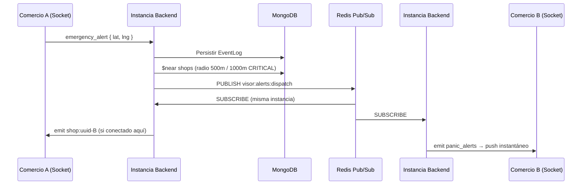

# Alert Dispatch — Redis Pub/Sub + Geocercado

Arquitectura de entrega instantánea de alertas entre comercios con filtrado geográfico y escalado horizontal.

## Problema

El broadcast anterior usaba salas por ciudad (`city:sao_paulo`), lo que notificaba a **todos** los comercios conectados en la ciudad, generando ruido innecesario. Además, Socket.io en un solo proceso no escala horizontalmente sin un bus de mensajes compartido.

## Solución

Dos capas complementarias:

1. **Geocercado (MongoDB `$near`)** — determina *quién* debe recibir la alerta.
2. **Redis Pub/Sub** — propaga el mensaje a *todas* las instancias del backend para entrega WebSocket local.



## Geocercado

| Parámetro | Valor |
|-----------|-------|
| Radio estándar | 500 m (`ALERT_RADIUS_METERS`) |
| Radio CRITICAL | 1000 m (`CRITICAL_ALERT_RADIUS_METERS`) |
| Índice MongoDB | `2dsphere` en `shops.location` |
| Filtro adicional | Misma `city` del emisor |
| Exclusión | El comercio emisor no recibe su propia alerta |
| Límite | 50 comercios por consulta |

Consulta (simplificada):

```javascript
Shop.find({
  city: "São Paulo",
  _id: { $ne: senderShopId },
  location: {
    $near: {
      $geometry: { type: "Point", coordinates: [lng, lat] },
      $maxDistance: radiusMeters
    }
  }
})
```

## Message Broker (Redis)

### Canal

`visor:alerts:dispatch` — un único canal; el filtrado geográfico ya ocurrió antes de publicar.

### Payload (`AlertDispatchMessage`)

```json
{
  "event_id": "uuid",
  "socket_event": "panic_alerts",
  "payload": { "...FeedEventItem..." },
  "recipient_shop_ids": ["shop-b-id", "shop-c-id"],
  "exclude_socket_id": "socket-del-emisor",
  "origin_instance_id": "node-1",
  "geofence": { "lat": -23.55, "lng": -46.63, "radius_meters": 500 },
  "published_at": "2026-06-20T12:00:00.000Z"
}
```

### Entrega local

Cada instancia suscrita emite a salas `shop:{shopId}` (el socket ya se une en el middleware JWT al conectar):

```
io.to("shop:00000000-...-0002").emit("panic_alerts", payload)
```

### Modos de operación

| Modo | Variable | Uso |
|------|----------|-----|
| Single-node (dev) | `REDIS_ENABLED` ausente/false | `InProcessAlertBroker` — entrega directa en memoria |
| Multi-node (prod) | `REDIS_ENABLED=true` + `REDIS_URL` | `RedisAlertBroker` — Pub/Sub entre réplicas |

Variables de entorno:

```env
REDIS_ENABLED=true
REDIS_URL=redis://localhost:6379
INSTANCE_ID=node-1   # opcional, identifica la instancia en logs
```

### Docker Compose (local)

```bash
docker compose up -d redis    # solo Redis
docker compose up -d          # Redis + MongoDB local
```

Servicios:

| Servicio | Puerto | Uso |
|----------|--------|-----|
| `redis` | 6379 | Pub/Sub entre instancias backend |
| `mongo` | 27017 | MongoDB local (alternativa a Atlas) |

### Pruebas de integración

```bash
npm run docker:up              # levantar Redis
npm run test:integration       # geocerca + A→B single-node + A→B Redis
```

| Test | Requisito |
|------|-----------|
| `geofence.integration.test.ts` | MongoDB en memoria (automático) |
| `alertDispatch.inprocess.integration.test.ts` | MongoDB en memoria |
| `alertDispatch.redis.integration.test.ts` | Redis en `127.0.0.1:6379` (se omite si no está) |

## Salas Socket.io

| Sala | Propósito |
|------|-----------|
| `shop:{shopId}` | Push dirigido por geocercado (alertas) |
| `city:{ciudad}` | Historial de feed al unirse (`join_city`) — sin broadcast masivo |

## Servicios

| Servicio | Responsabilidad |
|----------|-----------------|
| `GeofenceService` | Resuelve `recipient_shop_ids` vía MongoDB |
| `AlertDispatchService` | Orquesta geocerca → Redis → entrega local |
| `RedisAlertBroker` | Pub/Sub Redis |
| `InProcessAlertBroker` | Fallback dev sin Redis |

## Flujo de eventos

- `emergency_alert` / `panic_alert` → `panic_alerts` (geocercado + Redis)
- `new_report` / `quick_report` → `feed_updates` + `report_created` (geocercado + Redis)
- `confirm_report` → sigue usando `city:*` (confirmaciones visibles en la ciudad)

## Escalabilidad futura

- **Geohash rooms**: subdividir por celdas geohash para reducir consultas `$near` en ciudades densas.
- **Redis Streams**: persistencia y replay si un nodo cae durante la entrega.
- **Socket.io Redis Adapter**: alternativa para broadcast genérico; el enfoque actual es más eficiente porque solo emite a shops elegibles.
