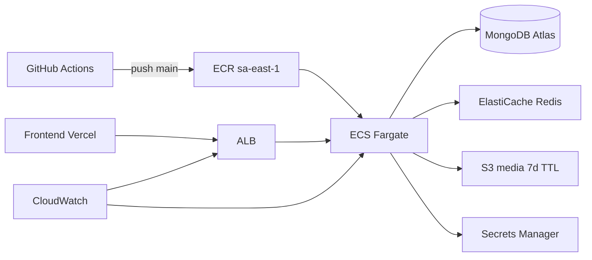
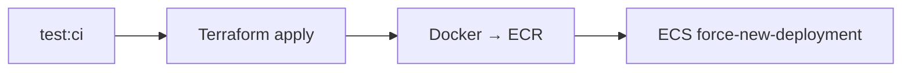

# Despliegue en la nube — Visor Protect Comercio

Guía operativa para **Infrastructure as Code**, **CI/CD** y **checklist Go-Live**.

**Región de producción:** `sa-east-1` (São Paulo).

---

## Arquitectura (AWS)



| Componente | Servicio | Rol |
|------------|----------|-----|
| Compute | **ECS Fargate + ALB** | Node.js + Socket.io, rolling deploy |
| Database | **MongoDB Atlas M10** | Geo + TTL (URI en Secrets Manager) |
| Pub/Sub alertas | **ElastiCache Redis** | Bus entre tareas ECS |
| Media | **S3** | Lifecycle 7 días |
| Secretos | **Secrets Manager** | MONGO_URI, JWT, Cloudinary |
| Frontend | **Vercel** | Web App React |
| CI/CD | **GitHub Actions** | Tests + Terraform + ECR + ECS |
| Observabilidad | **CloudWatch** | ALB 5xx/latencia, ECS logs, Redis CPU |

---

## 1. Provisionar infraestructura (Terraform)

En CI: workflow `.github/workflows/deploy.yml` (push a `main`).

Local (opcional):

```bash
cd infrastructure/terraform
terraform init
terraform plan -var="enable_ecs=true" -var="github_org=..." -var="cors_origin=..."
```

Variables GitHub → ver [ACTIONS_SETUP.md](../.github/ACTIONS_SETUP.md).

---

## 2. MongoDB Atlas (M10)

1. Cluster en región cercana a Brasil (ej. `SA_EAST_1` en Atlas).
2. Índices `2dsphere` y TTL — `syncMongoIndexes()` al arrancar.
3. Connection string en Secrets Manager → `visor-protect-production/mongo-uri`.

---

## 3. Pipeline CI/CD

### CI (cada PR / push)

Workflow: `.github/workflows/ci.yml` → `npm run test:ci`.

### CD (push a `main`)

Workflow: `.github/workflows/deploy.yml`



1. **quality-gate** — tests.
2. **terraform** — bootstrap, plan, apply, artifact `terraform-state`.
3. **deploy-app** — build, push ECR, actualizar servicio ECS.

Redeploy solo app: `.github/workflows/deploy-production.yml` (manual).

**Frontend:** [FRONTEND_DEPLOY.md](./FRONTEND_DEPLOY.md)  
**Fase 2 / Go-Live:** [PHASE_2.md](./PHASE_2.md)

---

## 4. Checklist Go-Live

### Secret Management

- [ ] Secretos solo en **Secrets Manager** (`sa-east-1`)
- [ ] Sin `.env` con secretos en el repo
- [ ] JWT rotación documentada

### Monitoreo

- [ ] Alarmas ALB 5xx y latencia p95
- [ ] Logs ECS `/ecs/visor-protect-production-backend`
- [ ] Alarma CPU Redis

### Escalabilidad

- [ ] ECS `desired_count` acorde a carga
- [ ] Redis `cache.t4g.micro` → escalar si CPU > 75%

### Calidad y seguridad

- [ ] CI verde en `main`
- [ ] `GET /health` → `mongodb_connected`, broker Redis
- [ ] `CORS_ORIGIN` = URL Vercel exacta
- [ ] `VITE_API_URL` = ALB en `sa-east-1`
- [ ] Demo seed **no** en producción

### Retención LGPD

- [ ] S3 lifecycle 7 días
- [ ] TTL MongoDB `messages`
- [ ] Ver [DATA_RETENTION.md](./DATA_RETENTION.md)

---

## 5. Verificación post-deploy

```bash
# URL desde output Terraform o resumen GitHub Actions
curl -s "http://<ALB_DNS>/health"
```

---

## 6. Rollback

```bash
aws ecs update-service \
  --cluster visor-protect-production-backend \
  --service visor-protect-production-backend \
  --force-new-deployment \
  --region sa-east-1
```

O workflow **Redeploy App Only** tras push de imagen anterior a ECR.

---

## 7. Costos (referencia)

| Recurso | Nota |
|---------|------|
| NAT + VPC endpoints + ALB | Fijo ~USD 55–70/mes |
| Fargate 0.25 vCPU | ~USD 10–15/mes |
| Redis micro | ~USD 12/mes |
| Atlas M10 | Según plan Atlas |

---

## Referencias

- [Terraform README](../infrastructure/terraform/README.md)
- [ALERT_DISPATCH.md](./ALERT_DISPATCH.md)
- [DATA_RETENTION.md](./DATA_RETENTION.md)
