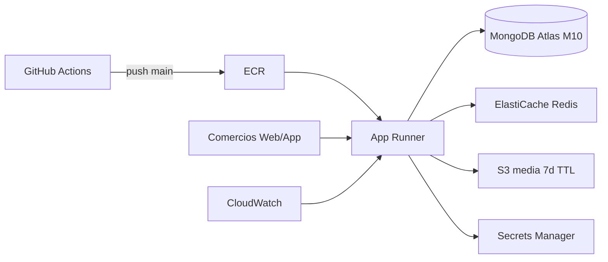
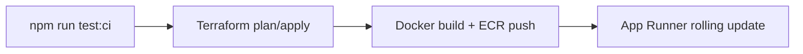

# Despliegue en la nube — Visor Protect Comercio

Guía operativa para **Infrastructure as Code**, **CI/CD sin intervención humana** y **checklist Go-Live**.

---

## Arquitectura (AWS)



| Componente | Servicio | Rol |
|------------|----------|-----|
| Compute | **App Runner** | Node.js + Socket.io, auto-scaling, rolling deploy |
| Database | **MongoDB Atlas M10** | Geo + TTL (externo, URI en Secrets Manager) |
| Pub/Sub alertas | **ElastiCache Redis** | Bus entre instancias App Runner |
| Media | **S3** | Lifecycle 7 días (`visor-protect/chat/`) |
| Secretos | **Secrets Manager** | MONGO_URI, JWT, Cloudinary |
| CI/CD | **GitHub Actions + OIDC** | Sin access keys estáticas |
| Observabilidad | **CloudWatch** | Latencia p95, errores, CPU Redis |

Push móvil (AWS SNS) queda como fase 2; el backend ya emite `alert_push` vía Socket.io.

---

## 1. Provisionar infraestructura (Terraform)

```bash
cd infrastructure/terraform
cp terraform.tfvars.example terraform.tfvars
# Editar: github_org, cors_origin

terraform init && terraform plan && terraform apply
```

Registrar outputs en **GitHub → Settings → Secrets and variables → Actions**:

| Secret / Variable | Origen |
|-------------------|--------|
| `AWS_DEPLOY_ROLE_ARN` | `terraform output github_deploy_role_arn` |
| `APP_RUNNER_SERVICE_ARN` | `terraform output app_runner_service_arn` |
| Variable `AWS_REGION` | ej. `sa-east-1` |
| Variable `ECR_REPOSITORY` | ej. `visor-protect-backend` |

---

## 2. MongoDB Atlas (M10)

1. Crear cluster **M10** en la misma región lógica (São Paulo).
2. Habilitar **2dsphere** en `shops`, `alert_events` (se sincronizan al arrancar con `syncMongoIndexes()`).
3. Verificar TTL en `messages` — ver [DATA_RETENTION.md](./DATA_RETENTION.md).
4. Restringir **Network Access** a IPs de App Runner o `0.0.0.0/0` temporalmente durante bootstrap (recomendado: VPC peering o PrivateLink en fase avanzada).
5. Copiar connection string a Secrets Manager → `{prefix}/mongo-uri`.

---

## 3. Pipeline CI/CD

### Continuous Integration (cada PR)

Workflow: `.github/workflows/ci.yml`

- `npm ci`
- `npm run typecheck`
- `npm run test:integration` (12 tests; Redis skip si no hay servicio)

Si falla cualquier paso, **no se despliega**.

### Continuous Deployment (push a `main`)

Workflow unificado: `.github/workflows/deploy.yml`

**Fase 2 (App Runner):** ver checklist en [PHASE_2.md](./PHASE_2.md).



1. **quality-gate** — `npm run test:ci` (18 tests).
2. **terraform** — `fmt` → `init` → `validate` → `plan` → `apply`.
3. **deploy-app** — build Docker, push a ECR (URL desde outputs Terraform), `apprunner start-deployment`.

Redeploy solo app (sin Terraform): `.github/workflows/deploy-production.yml` → *Redeploy App Only* (manual).

Frontend (opcional): build con `docker build -f frontend/Dockerfile .` y servir vía CloudFront + S3 o segundo App Runner.

---

## 4. Checklist Go-Live

### Secret Management

- [ ] `MONGO_URI`, `JWT_SECRET`, `CLOUDINARY_*` solo en **Secrets Manager** / env del servicio cloud
- [ ] Ningún `.env` con secretos en el repositorio
- [ ] Rotación documentada para JWT (ventana de logout forzado)

### Monitoreo (Observabilidad)

- [ ] Alarmas CloudWatch activas (latencia p95 > 200 ms, errores 5xx, CPU Redis)
- [ ] Logs App Runner en `/aws/apprunner/...` (retención 14 días)
- [ ] (Opcional) Datadog APM con agent sidecar o integración CloudWatch

### Escalabilidad automática

- [ ] App Runner: `min_size=1`, `max_size=10` (Terraform `app_runner_*`)
- [ ] ElastiCache: `cache.t4g.micro` inicial; escalar a `cache.t4g.small` si CPU > 75% sostenido
- [ ] Atlas: auto-scaling de storage habilitado en M10+

### Calidad y seguridad

- [ ] CI verde en `main` antes de tráfico real
- [ ] `GET /health` responde `mongodb_connected` y `alert_broker: redis`
- [ ] CORS apunta al dominio del frontend (`CORS_ORIGIN`)
- [ ] Cookies `Secure` + `SameSite=none` en producción cross-origin
- [ ] Demo seed **no** ejecutado en producción

### Retención LGPD

- [ ] S3 lifecycle 7 días en prefijo chat (Terraform `s3.tf`)
- [ ] TTL MongoDB `messages` verificado en Atlas
- [ ] Cloudinary folder `visor-protect/chat` alineado — ver [DATA_RETENTION.md](./DATA_RETENTION.md)

---

## 5. Bootstrap manual (primera imagen)

App Runner requiere al menos una imagen en ECR:

```bash
ECR_URL=$(terraform output -raw ecr_repository_url)
aws ecr get-login-password --region sa-east-1 | docker login --username AWS --password-stdin ${ECR_URL%%/*}

docker build -t visor-protect-backend .
docker tag visor-protect-backend:latest $ECR_URL:latest
docker push $ECR_URL:latest

aws apprunner start-deployment --service-arn $(terraform output -raw app_runner_service_arn)
```

Verificar:

```bash
curl https://$(terraform output -raw app_runner_service_url | sed 's|https://||')/health
```

---

## 6. Rollback

```bash
# Listar imágenes en ECR y redeploy tag anterior
aws apprunner start-deployment --service-arn $APP_RUNNER_SERVICE_ARN
# (App Runner usa la imagen configurada en la revisión activa; actualizar servicio al tag deseado si es necesario)
```

Git revert + push a `main` dispara redeploy automático con la imagen del commit anterior.

---

## 7. Costos optimizados (defaults)

| Recurso | Default | Escalar cuando |
|---------|---------|----------------|
| App Runner | 0.25 vCPU, 1 instancia | Latencia > 200 ms o CPU sostenida |
| Redis | cache.t4g.micro | Alarmas CPU Redis |
| Atlas | M10 | > 80% conexiones o IOPS |

Staging: usar `environment=staging`, `app_runner_min_size=0`, Atlas M0/M2 solo para QA.

---

## Referencias

- [Terraform README](../infrastructure/terraform/README.md)
- [ALERT_DISPATCH.md](./ALERT_DISPATCH.md)
- [DATA_RETENTION.md](./DATA_RETENTION.md)
