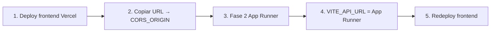

# Despliegue del frontend (Vercel / Netlify)

Guía para publicar la Web App React y obtener la URL de **`CORS_ORIGIN`** antes de la fase 2 (App Runner).

---

## Variables de build (Vite)

Se inyectan en **tiempo de build** (no en runtime). Tras cambiarlas, hay que **redeploy**.

| Variable | Descripción | Ejemplo producción |
|----------|-------------|-------------------|
| `VITE_API_URL` | URL del backend (REST) | `http://xxxxx.us-east-1.elb.amazonaws.com` |
| `VITE_SOCKET_URL` | URL del backend (WebSockets) | Igual que `VITE_API_URL` |
| `VITE_SHOP_ID` | UUID del comercio (demo/bootstrap) | UUID real del shop |
| `VITE_SHOP_NAME` | Nombre mostrado | `Mi Comercio` |
| `VITE_CITY_NAME` | Ciudad para sala Socket.io | `São Paulo` |

En local: ver `frontend/.env.example`.

---

## Orden recomendado (con fase 2)



1. **Primer deploy** del frontend (API puede ser temporal o vacía).
2. Copiar URL pública → GitHub Variable **`CORS_ORIGIN`** (ej. `https://visor-protect.vercel.app`).
3. Activar fase 2 (`AWS_REGION=sa-east-1`, `ENABLE_ECS=true`).
4. Copiar **`backend_service_url`** (ALB) → `VITE_API_URL` y `VITE_SOCKET_URL` en Vercel/Netlify.
5. **Redeploy** del frontend.

---

## Opción A — Vercel (recomendada)

### 1. Conectar repositorio

1. [vercel.com](https://vercel.com) → **Add New → Project**.
2. Importar `sergiolazer/VISOR_PROTECT_COMERCIAL`.
3. **Root Directory:** dejar **`.`** (raíz del monorepo).
4. Vercel detecta `vercel.json` en la raíz.
5. **Settings → Build & Development:** Output Directory = `dist` (o vacío para usar `vercel.json`).

### 2. Build settings (verificar)

| Campo | Valor |
|-------|-------|
| Framework Preset | Other |
| Install Command | `npm ci` |
| Build Command | *(vacío — `vercel.json` ejecuta build con `-w`)* |
| Output Directory | `dist` (Vite escribe en raíz cuando `VERCEL=1`) |
| Node.js Version | **24** (Settings → General → Node.js Version) |

### 3. Environment Variables (primer deploy)

Para obtener solo la URL de CORS, puedes usar valores temporales:

| Key | Valor temporal |
|-----|----------------|
| `VITE_API_URL` | `https://placeholder.awsapprunner.com` |
| `VITE_SOCKET_URL` | `https://placeholder.awsapprunner.com` |

Tras fase 2, sustituir por la URL real de App Runner y **Redeploy**.

### 4. Deploy

**Deploy** → anotar la URL de producción, ej.:

`https://visor-protect-comercial.vercel.app`

Esa URL es tu **`CORS_ORIGIN`** en GitHub.

### 5. Dominio propio (opcional)

Vercel → Project → **Domains** → añadir `app.tudominio.com.br` → actualizar DNS.

Usar `https://app.tudominio.com.br` como `CORS_ORIGIN`.

---

## Opción B — Netlify

1. [app.netlify.com](https://app.netlify.com) → **Add new site → Import an existing project**.
2. Conectar GitHub → mismo repositorio.
3. Netlify lee `netlify.toml` en la raíz.
4. **Site settings → Environment variables** — mismas `VITE_*` que arriba.
5. Deploy → URL tipo `https://random-name.netlify.app` → **`CORS_ORIGIN`**.

---

## Verificación local antes de deploy

```bash
npm ci
npm run build-web
npx serve frontend/dist
```

Abrir `http://localhost:3000` (o el puerto que indique `serve`).

---

## CORS y cookies

El backend en App Runner usa (Terraform):

- `CORS_ORIGIN` = URL exacta del frontend (sin `/` final).
- `COOKIE_SECURE=true`, `COOKIE_SAME_SITE=none` para cookies cross-origin.

El frontend ya usa `withCredentials: true` en Socket.io y fetch con cookies.

**Importante:** `CORS_ORIGIN` y la URL del navegador deben coincidir (mismo `https` y host).

---

## Checklist

- [ ] Frontend desplegado y URL pública accesible
- [ ] `CORS_ORIGIN` en GitHub = esa URL
- [ ] Fase 2 completada → `app_runner_service_url` disponible
- [ ] `VITE_API_URL` + `VITE_SOCKET_URL` = URL App Runner
- [ ] Redeploy frontend
- [ ] Login y chat funcionan en producción

---

## Troubleshooting Vercel

### `No Output Directory named "dist" found`

1. **Root Directory** debe ser **`.`** (raíz), no `frontend`. Si está en `frontend`, npm busca scripts ahí y falla.
2. **Output Directory** = `dist` o déjalo vacío (usa `vercel.json`).
3. **Build Command** vacío o `npm run vercel-build` — no uses `frontend/dist` como output.
4. Con `VERCEL=1`, Vite escribe en `/dist` en la raíz (ver `frontend/vite.config.ts`).
5. **Redeploy** tras el último push a `main`.

Si el dashboard tiene valores antiguos de un deploy fallido, en **Settings → General → Build & Development** pulsa **Reset** o alinea con la tabla de arriba.

---

## Referencias

- [PHASE_2.md](./PHASE_2.md) — App Runner y migración `us-east-1`
- [ACTIONS_SETUP.md](../.github/ACTIONS_SETUP.md) — variables GitHub
