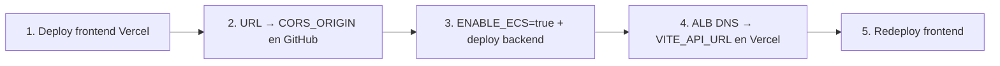

# Despliegue del frontend (Vercel / Netlify)

Guía para publicar la Web App React y enlazarla al backend **ECS Fargate + ALB** en **`sa-east-1` (São Paulo)**.

> **Región:** Todo el backend vive en `sa-east-1`. No uses `us-east-1` salvo que migres el stack completo (no recomendado).

---

## Variables de build (Vite)

Se inyectan en **tiempo de build** (no en runtime). Tras cambiarlas, hay que **Redeploy** en Vercel.

| Variable | Descripción | Ejemplo producción |
|----------|-------------|-------------------|
| `VITE_API_URL` | URL del backend (REST) | `http://visor-protect-production-backend-XXXX.sa-east-1.elb.amazonaws.com` |
| `VITE_SOCKET_URL` | URL del backend (WebSockets) | Igual que `VITE_API_URL` |
| `VITE_SHOP_ID` | UUID del comercio (demo/bootstrap) | UUID real del shop |
| `VITE_SHOP_NAME` | Nombre mostrado | `Mi Comercio` |
| `VITE_CITY_NAME` | Ciudad para sala Socket.io | `São Paulo` |

En local: ver `frontend/.env.example`.

---

## Orden recomendado

1. **Primer deploy** del frontend (API puede ser placeholder).
2. Copiar URL pública → GitHub Variable **`CORS_ORIGIN`** (ej. `https://visor-protect-comercial-frontend.vercel.app`).
3. Activar backend: `AWS_REGION=sa-east-1`, `ENABLE_ECS=true` → workflow **Production Deploy**.
4. Copiar **`backend_service_url`** del job Terraform (resumen *Frontend — actualizar Vercel*) → `VITE_API_URL` y `VITE_SOCKET_URL`.
5. **Redeploy** del frontend en Vercel.

---

## Opción A — Vercel (recomendada)

### 1. Conectar repositorio

1. [vercel.com](https://vercel.com) → **Add New → Project**.
2. Importar `sergiolazer/VISOR_PROTECT_COMERCIAL`.
3. **Root Directory:** **`.`** (raíz del monorepo).
4. Vercel detecta `vercel.json` en la raíz.

### 2. Build settings

| Campo | Valor |
|-------|-------|
| Framework Preset | Other |
| Install Command | `npm ci` |
| Build Command | *(vacío — `vercel.json`)* |
| Output Directory | `dist` |
| Node.js Version | **24** |

### 3. Environment Variables

**Primer deploy** (solo para obtener `CORS_ORIGIN`):

| Key | Valor temporal |
|-----|----------------|
| `VITE_API_URL` | `http://localhost:3001` |
| `VITE_SOCKET_URL` | `http://localhost:3001` |

**Tras el ALB en producción** (sustituir y Redeploy):

| Key | Valor |
|-----|-------|
| `VITE_API_URL` | `http://<ALB_DNS>` (output `backend_service_url`) |
| `VITE_SOCKET_URL` | Igual que `VITE_API_URL` |

### 4. Deploy

URL de producción típica:

`https://visor-protect-comercial-frontend.vercel.app`

→ esa URL va en **`CORS_ORIGIN`** (GitHub Actions Variables).

### 5. Dominio propio (opcional)

Vercel → **Domains** → `app.tudominio.com.br` → actualizar **`CORS_ORIGIN`** con la URL final.

---

## Opción B — Netlify

1. Importar repo; Netlify lee `netlify.toml`.
2. Mismas variables `VITE_*` que arriba.
3. URL del sitio → **`CORS_ORIGIN`** en GitHub.

---

## CORS y cookies

El backend (ECS) usa:

- `CORS_ORIGIN` = URL exacta del frontend (sin `/` final).
- `COOKIE_SECURE=true`, `COOKIE_SAME_SITE=none` en producción cross-origin.

El frontend usa `withCredentials: true` en Socket.io y fetch.

**Importante:** `CORS_ORIGIN` y la URL del navegador deben coincidir (`https` + mismo host).

---

## Checklist

- [ ] Frontend desplegado y URL pública accesible
- [ ] `CORS_ORIGIN` en GitHub = esa URL
- [ ] Backend: `curl http://<ALB_DNS>/health` → 200
- [ ] `VITE_API_URL` + `VITE_SOCKET_URL` = URL del ALB (`sa-east-1`)
- [ ] Redeploy frontend en Vercel
- [ ] Login y chat funcionan en producción

---

## Troubleshooting Vercel

### `No Output Directory named "dist" found`

1. **Root Directory** = **`.`** (raíz), no `frontend`.
2. **Output Directory** = `dist`.
3. **Redeploy** tras cambios en `vercel.json`.

### API no responde / CORS error

1. Verificar `VITE_API_URL` apunta al ALB actual (cambia si se recrea el ALB).
2. Verificar `CORS_ORIGIN` en GitHub = URL exacta del frontend.
3. Consola AWS en región **São Paulo (`sa-east-1`)**, no Virginia.

---

## Referencias

- [PHASE_2.md](./PHASE_2.md) — ECS Fargate + ALB
- [ACTIONS_SETUP.md](../.github/ACTIONS_SETUP.md) — variables GitHub
