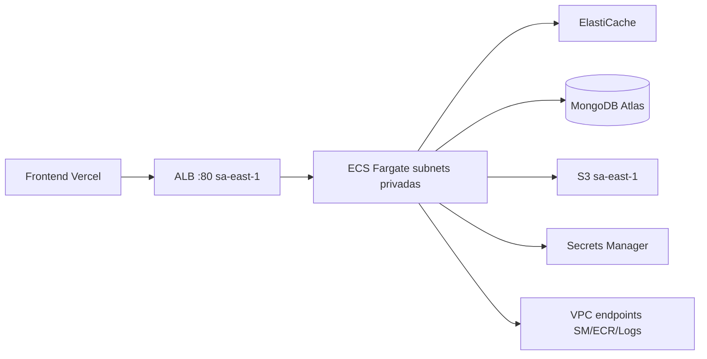

# Fase 2 — ECS Fargate y Go-Live

Guía para activar y operar el backend en producción tras el bootstrap (fase 1).

> **Compute:** **ECS Fargate + ALB** (no App Runner).  
> **Región:** **`sa-east-1` (São Paulo)** — latencia Brasil, ECS disponible. **No migrar a `us-east-1`** salvo requisito excepcional.

## Por qué `sa-east-1` y no Virginia

| Opción | `sa-east-1` | `us-east-1` |
|--------|-------------|-------------|
| ECS Fargate + ALB | Sí | Sí |
| App Runner (legacy) | No | Sí (deprecado en este proyecto) |
| Latencia usuarios BR | Mejor | Peor |
| Stack actual (Redis, ECR, secrets) | Ya desplegado aquí | Requeriría migración total |

---

## Estado tras fase 1

| Recurso | Región | Estado |
|---------|--------|--------|
| ECR + imagen `:latest` | `sa-east-1` | Listo |
| VPC, Redis, S3, Secrets, IAM | `sa-east-1` | Listo |
| ECS Fargate + ALB | `sa-east-1` | `ENABLE_ECS=true` |

## Variables GitHub (producción)

| Variable | Valor |
|----------|-------|
| `AWS_REGION` | **`sa-east-1`** |
| `ENABLE_ECS` | `true` |
| `CORS_ORIGIN` | URL del frontend (Vercel), ej. `https://visor-protect-comercial-frontend.vercel.app` |
| `GITHUB_ORG` | No crear — GitHub bloquea el prefijo `GITHUB_`. El workflow usa `sergiolazer` vía `repository_owner`. Solo define `TF_GITHUB_ORG` si el org difiere del dueño del repo. |
| `GITHUB_REPO` | `VISOR_PROTECT_COMERCIAL` *(opcional)* |
| `ECR_IMAGE_TAG` | `latest` *(opcional)* |

`ENABLE_APP_RUNNER=true` es alias legacy de `ENABLE_ECS` (mismo efecto).

---

## Configuración paso a paso (orden actual)

### 1. Secretos AWS (`sa-east-1`)

En **Secrets Manager** (región São Paulo), valores reales en:

- `visor-protect-production/mongo-uri`
- `visor-protect-production/jwt-secret`
- `visor-protect-production/cloudinary`

Validación local (opcional):

```bash
bash scripts/phase2-secrets.sh export ~/visor-protect-secrets-phase2.json
bash scripts/phase2-secrets.sh validate ~/visor-protect-secrets-phase2.json
```

### 2. GitHub Actions

**Settings → Secrets and variables → Actions**

| Tipo | Nombre | Valor |
|------|--------|-------|
| Secret | `AWS_ACCESS_KEY_ID` | IAM con Terraform + ECR + ECS |
| Secret | `AWS_SECRET_ACCESS_KEY` | *pareja del anterior* |
| Variable | `AWS_REGION` | `sa-east-1` |
| Variable | `ENABLE_ECS` | `true` |
| Variable | `CORS_ORIGIN` | URL Vercel del frontend |

### 3. Deploy backend

Push a `main` o **Actions → Production Deploy → Run workflow**.

El job **Terraform** debe terminar en verde. En el resumen del job verás **Frontend — actualizar Vercel** con `backend_service_url`.

### 4. Verificar AWS (`sa-east-1`)

En la consola, región **São Paulo**:

| Check | Esperado |
|-------|----------|
| ECS servicio `visor-protect-production-backend` | 1 tarea **Running** |
| Target group | Targets **healthy** |
| ALB VPC | `vpc-05414285d00010eff` (ancla) |
| `curl http://<ALB_DNS>/health` | HTTP 200 |

### 5. Vercel (frontend)

**Settings → Environment Variables → Production:**

```
VITE_API_URL=http://<ALB_DNS>
VITE_SOCKET_URL=http://<ALB_DNS>
```

**Deployments → Redeploy** (obligatorio tras cambiar `VITE_*`).

### 6. Prueba end-to-end

1. Abrir URL Vercel del frontend.
2. Login / registro.
3. DevTools → Network: peticiones al host `*.sa-east-1.elb.amazonaws.com`.

---

## Arquitectura ECS



---

## Costos aproximados (ECS fase 2)

| Recurso | Nota |
|---------|------|
| NAT Gateway | ~USD 32/mes + tráfico |
| VPC endpoints | ~USD 7–15/mes (interface) |
| ALB | ~USD 16/mes base |
| Fargate 0.25 vCPU | ~USD 10–15/mes |
| ElastiCache micro | ~USD 12/mes |

---

## Rollback

- Imagen anterior en ECR → workflow **Redeploy App Only** o `aws ecs update-service --force-new-deployment`.
- Infra: `git revert` + push (con precaución; revisar plan Terraform).

---

## Referencias

- [FRONTEND_DEPLOY.md](./FRONTEND_DEPLOY.md)
- [DEPLOYMENT.md](./DEPLOYMENT.md)
- [ACTIONS_SETUP.md](../.github/ACTIONS_SETUP.md)
