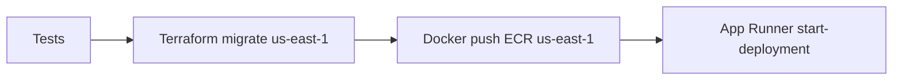

# Fase 2 — App Runner y Go-Live

Guía para activar el backend en producción tras el bootstrap exitoso (fase 1).

## Estado actual (fase 1 completada)

| Recurso | Región | Estado |
|---------|--------|--------|
| ECR + imagen `:latest` | `sa-east-1` | Listo |
| VPC, Redis, S3, Secrets, IAM | `sa-east-1` | Listo |
| App Runner | — | No desplegado |
| `terraform-state` artifact | GitHub Actions | Persistido tras cada deploy en `main` |

## Limitación regional

**App Runner no existe en `sa-east-1`.** La fase 2 migra el stack Terraform a **`us-east-1`** (u otra región soportada). Al cambiar `AWS_REGION`, Terraform planificará **destruir** recursos en São Paulo y **crear** equivalentes en Virginia.

Impacto esperado:

- Nueva URL de ECR → el workflow volverá a hacer `docker push`.
- Nuevo Redis (caché vacía; aceptable para alertas).
- Nuevos secretos en Secrets Manager → **copiar valores** desde `sa-east-1` antes o justo después del apply.
- Recursos huérfanos en `sa-east-1` solo si el apply falla a medias — revisar consola AWS.

## Checklist previo

### 1. Secretos en AWS (región actual `sa-east-1`)

En [Secrets Manager](https://sa-east-1.console.aws.amazon.com/secretsmanager/) actualiza:

| Secreto | Formato |
|---------|---------|
| `visor-protect-production/mongo-uri` | Connection string MongoDB Atlas M10 |
| `visor-protect-production/jwt-secret` | String aleatorio ≥ 32 caracteres |
| `visor-protect-production/cloudinary` | JSON: `{"cloud_name":"...","api_key":"...","api_secret":"..."}` |

Guarda una copia local segura — los necesitarás de nuevo tras la migración a `us-east-1`.

### 2. MongoDB Atlas

- Cluster M10+ en región cercana a `us-east-1` (ej. `us-east-1` o `sa-east-1` con latencia aceptable).
- Network Access: permitir `0.0.0.0/0` durante bootstrap o IPs de salida de App Runner.
- Índices 2dsphere y TTL (el backend ejecuta `syncMongoIndexes()` al arrancar).

### 3. Variables GitHub (Settings → Actions → Variables)

| Variable | Valor fase 2 | Obligatorio |
|----------|--------------|-------------|
| `AWS_REGION` | `us-east-1` | Sí |
| `ENABLE_APP_RUNNER` | `true` | Sí |
| `CORS_ORIGIN` | URL del frontend, ej. `https://app.tudominio.com.br` | Sí |
| `GITHUB_ORG` | Tu usuario/org (opcional si coincide con el repo) | No |
| `ECR_IMAGE_TAG` | `latest` | No |

### 4. Verificar artifact `terraform-state`

1. GitHub → **Actions** → último run de *Production Deploy* → **Artifacts**.
2. Debe existir `terraform-state` (retención 90 días).
3. En el log del job *Terraform*, busca:
   - `State restaurado desde artifact` (run ≥ 2), o
   - `Sin artifact terraform-state` (solo primer run).
4. Tras apply: `State persistido (serial=…, resource_instances=…)`.

> **Recomendación producción:** migrar a backend S3 remoto (ver `infrastructure/terraform/versions.tf`).

## Ejecutar fase 2

1. Completa el checklist anterior.
2. Configura las variables GitHub.
3. **Push a `main`** o **Run workflow** manual en *Production Deploy*.

Flujo esperado:



4. Tras el apply, copia outputs del log o consola:
   - `app_runner_service_url` → URL pública del API.
   - `app_runner_service_arn` → guardar en variable `APP_RUNNER_SERVICE_ARN` (redeploy manual).

5. Actualiza secretos en **Secrets Manager `us-east-1`** si Terraform creó placeholders nuevos.

6. Verifica salud:

```bash
curl -s "https://<app-runner-url>/health" | jq .
```

Respuesta esperada: `mongodb_connected: true`, `alert_broker: "redis"`.

## Post fase 2 — Frontend

- Build del frontend apuntando `VITE_API_URL` (o equivalente) a `app_runner_service_url`.
- CORS en backend ya usa `CORS_ORIGIN` de Terraform.

## Rollback

- Git revert del commit que activó fase 2 + push (redeploy imagen anterior si existe en ECR).
- O workflow manual *Redeploy App Only* con tag de imagen anterior.

## Limpieza `sa-east-1` (opcional)

Si el apply de fase 2 terminó bien, los recursos de fase 1 en `sa-east-1` deberían haberse destruido por Terraform. Revisa manualmente:

- ECR `visor-protect-backend`
- ElastiCache `visor-protect-production-redis`
- VPC `visor-protect-production-vpc`
- Secrets Manager `visor-protect-production/*`

Elimina manualmente cualquier recurso huérfano para evitar costos.
