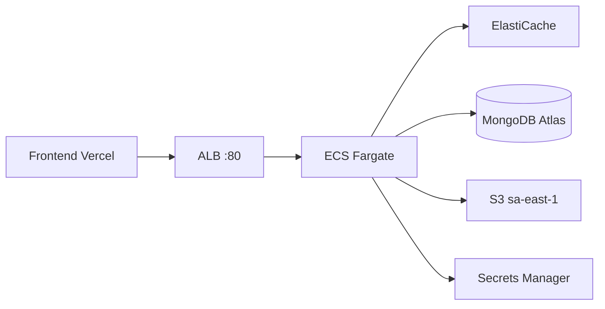

# Fase 2 — ECS Fargate y Go-Live

Guía para activar el backend en producción tras el bootstrap (fase 1).

> **App Runner:** AWS dejó de aceptar clientes nuevos (abr 2026). Este proyecto usa **ECS Fargate + ALB**.

## Estado tras fase 1

| Recurso | Región | Estado |
|---------|--------|--------|
| ECR + imagen `:latest` | configurable | Listo |
| VPC, Redis, S3, Secrets, IAM | configurable | Listo |
| ECS Fargate + ALB | — | `ENABLE_ECS=false` |

## Región recomendada

**`sa-east-1`** funciona con ECS (latencia Brasil). No hace falta migrar a `us-east-1`.

| Variable GitHub | Fase 1 | Fase 2 |
|-----------------|--------|--------|
| `AWS_REGION` | `sa-east-1` | `sa-east-1` (o `us-east-1`) |
| `ENABLE_ECS` | `false` | `true` |
| `CORS_ORIGIN` | opcional | URL del frontend (Vercel) |

`ENABLE_APP_RUNNER` sigue funcionando como alias legacy de `ENABLE_ECS`.

S3 media permanece en **`sa-east-1`** (nombre global).

## Checklist previo

1. Secretos validados (`phase2-secrets.sh export` + `validate`)
2. Frontend desplegado → [FRONTEND_DEPLOY.md](./FRONTEND_DEPLOY.md) → `CORS_ORIGIN`
3. GitHub Secrets AWS válidos

## Ejecutar fase 2

### Paso 1 — Secretos (si no lo hiciste)

```bash
bash scripts/phase2-secrets.sh export ~/visor-protect-secrets-phase2.json
bash scripts/phase2-secrets.sh validate ~/visor-protect-secrets-phase2.json
```

### Paso 2 — Variables GitHub

| Variable | Valor |
|----------|-------|
| `ENABLE_ECS` | `true` |
| `CORS_ORIGIN` | URL del frontend |
| `AWS_REGION` | `sa-east-1` |

### Paso 3 — Push / workflow

```bash
git commit --allow-empty -m "chore: activar fase 2 ECS Fargate"
git push origin main
```

Terraform crea: NAT Gateway, ALB, ECS cluster/service, task definition.

### Paso 4 — Secretos en la región del compute

Si `AWS_REGION=us-east-1`, importa secretos allí:

```bash
bash scripts/phase2-secrets.sh import ~/visor-protect-secrets-phase2.json us-east-1
```

Si te quedas en `sa-east-1`, los secretos de fase 1 ya aplican.

### Paso 5 — Verificar

```bash
# URL en output Terraform: backend_service_url
curl -s "http://<ALB_DNS>/health" | jq .
```

### Paso 6 — Frontend

```env
VITE_API_URL=http://<ALB_DNS>
VITE_SOCKET_URL=http://<ALB_DNS>
```

> HTTPS: añade certificado ACM + listener 443 en ALB (fase posterior).

## Arquitectura ECS



## Costos aproximados (ECS fase 2)

| Recurso | Nota |
|---------|------|
| NAT Gateway | ~USD 32/mes + tráfico |
| ALB | ~USD 16/mes base |
| Fargate 0.25 vCPU | ~USD 10–15/mes |
| ElastiCache micro | ~USD 12/mes |

## Rollback

`git revert` + push, o `aws ecs update-service --force-new-deployment` con imagen anterior en ECR.

## Referencias

- [FRONTEND_DEPLOY.md](./FRONTEND_DEPLOY.md)
- [ACTIONS_SETUP.md](../.github/ACTIONS_SETUP.md)
